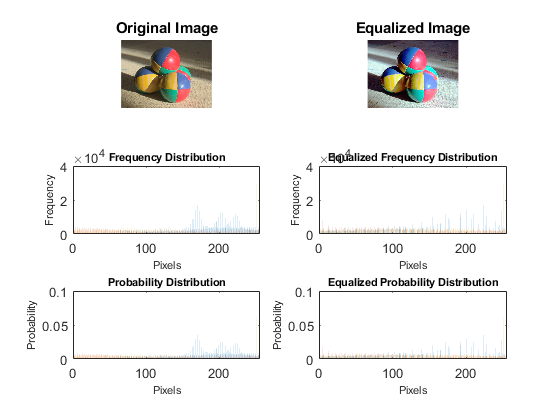

<!DOCTYPE html
  PUBLIC "-//W3C//DTD HTML 4.01 Transitional//EN">
<html><head>
      <meta http-equiv="Content-Type" content="text/html; charset=utf-8">
   <!--
This HTML was auto-generated from MATLAB code.
To make changes, update the MATLAB code and republish this document.
      --><title>finalHistogram</title><meta name="generator" content="MATLAB 9.3"><link rel="schema.DC" href="http://purl.org/dc/elements/1.1/"><meta name="DC.date" content="2018-06-11"><meta name="DC.source" content="finalHistogram.m"></head><body>
<pre class="codeinput">%Coded by: Amey Meher
%For queries drop a mail at: amey.meher@somaiya.edu
</pre><pre class="codeinput">%Original Image Probability and frequency distribution
%Read image
image1 = imread('sample1.jpg');

%Use the function
[totalPixels,redCounts,grayLevels] = histogram(image1,1);
[totalPixels,greenCounts,grayLevels] = histogram(image1,2);
[totalPixels,blueCounts,grayLevels] = histogram(image1,3);

pixelArray = cat(1,redCounts,greenCounts,blueCounts);
pixelArray = reshape(pixelArray,[256,3]);

%Plot the Probability distribution and finding the cumulative frequency
[redProbability,redCumulative] = equalize(redCounts,totalPixels);
[greenProbability,greenCumulative] = equalize(greenCounts,totalPixels);
[blueProbability,blueCumulative] = equalize(blueCounts,totalPixels);

probabilityArray = cat(1,redProbability,greenProbability,blueProbability);
probabilityArray = reshape(probabilityArray,[256,3]);
</pre><pre class="codeinput">%Equalizing the image
%Make the newImage
[rows,columns,numberOfChannels] = size(image1);
for i=1:rows
    for j=1:columns
        newImageRed(i,j) = 255 * redCumulative(image1(i,j,1) + 1);
        newImageGreen(i,j) = 255 * greenCumulative(image1(i,j,2) + 1);
        newImageBlue(i,j) = 255 * blueCumulative(image1(i,j,3) + 1);
    end
end

newImageRed = uint8(newImageRed);
newImageGreen = uint8(newImageGreen);
newImageBlue = uint8(newImageBlue);
newImage = cat(3,newImageRed,newImageGreen,newImageBlue);

%Use the function
[newTotalPixels,redNewCounts,newGrayLevels] = histogram(newImage,1);
[newTotalPixels,greenNewCounts,newGrayLevels] = histogram(newImage,2);
[newTotalPixels,blueNewCounts,newGrayLevels] = histogram(newImage,3);
newPixelArray = cat(1,redNewCounts,greenNewCounts,blueNewCounts);
newPixelArray = reshape(newPixelArray,[256,3]);

%Plot the Probability distribution and finding the cumulative frequency
[redNewProbability,redNewCumulative] = equalize(redNewCounts,newTotalPixels);
[greenNewProbability,greenNewCumulative] = equalize(greenNewCounts,newTotalPixels);
[blueNewProbability,blueNewCumulative] = equalize(blueNewCounts,newTotalPixels);
newProbabilityArray = cat(1,redNewProbability,greenNewProbability,blueNewProbability);
newProbabilityArray = reshape(newProbabilityArray,[256,3]);
</pre><pre class="codeinput">%Plotting the graphs
%Plot the histogram
plotHistogram(grayLevels,pixelArray,3,2,3,'Pixels','Frequency','Frequency Distribution');
plotHistogram(grayLevels,probabilityArray,3,2,5,'Pixels','Probability','Probability Distribution');
plotHistogram(newGrayLevels,newPixelArray,3,2,4,'Pixels','Frequency','Equalized Frequency Distribution');
plotHistogram(newGrayLevels,newProbabilityArray,3,2,6,'Pixels','Probability','Equalized Probability Distribution');

%Displaying before and after image
subplot(3,2,1);
imshow(image1);
title('Original Image');
subplot(3,2,2);
imshow(newImage);
title('Equalized Image');
</pre><pre class="codeinput">%Histogram function to calculate the counts of the pixels and the range of
%gray levels

function [totalPixels,counts,grayLevels] = histogram(image,channel)
    counts = zeros(1,256);
    grayLevels = 0:255;
    [rows, columns,numberOfChannels] = size(image);
    totalPixels = rows * columns;
    for i=1:rows
        for j=1:columns
            grayLevel = image(i,j,channel);
            counts(grayLevel + 1) = counts(grayLevel + 1) + 1;
        end
    end
end
</pre><pre class="codeinput">%Equalize function to calculate cumulative frequency distribution
function [probability,cumulative] = equalize(counts,totalPixels)
    probability = zeros(1,256);
    cumulative = zeros(1,256);
    for i=1:256
       probability(i) = counts(i) / totalPixels;
       if(i == 1)
           cumulative(i) = probability(i);
       else
           cumulative(i) = cumulative(i-1) + probability(i);
       end
    end
end
</pre><pre class="codeinput">%For plotting the histogram in a subplot using bar structure
function plotHistogram(grayLevels,counts,i,j,k,xLabel,yLabel,name)
    subplot(i,j,k);
    bar(grayLevels,counts);
    xlabel(xLabel, 'FontSize', 8);
    ylabel(yLabel, 'FontSize', 8);
    title(name, 'FontSize', 8);
end
</pre> 
 <a href="http://www.mathworks.com/products/matlab/">Published with MATLAB&reg; R2017b</a> 

<!--
##### SOURCE BEGIN #####
%%
%Coded by: Amey Meher
%For queries drop a mail at: amey.meher@somaiya.edu

%%
%Original Image Probability and frequency distribution
%Read image
image1 = imread('sample1.jpg');

%Use the function
[totalPixels,redCounts,grayLevels] = histogram(image1,1);
[totalPixels,greenCounts,grayLevels] = histogram(image1,2);
[totalPixels,blueCounts,grayLevels] = histogram(image1,3);

pixelArray = cat(1,redCounts,greenCounts,blueCounts);
pixelArray = reshape(pixelArray,[256,3]);
        
%Plot the Probability distribution and finding the cumulative frequency
[redProbability,redCumulative] = equalize(redCounts,totalPixels);
[greenProbability,greenCumulative] = equalize(greenCounts,totalPixels);
[blueProbability,blueCumulative] = equalize(blueCounts,totalPixels);

probabilityArray = cat(1,redProbability,greenProbability,blueProbability);
probabilityArray = reshape(probabilityArray,[256,3]);

%%
%Equalizing the image
%Make the newImage
[rows,columns,numberOfChannels] = size(image1);
for i=1:rows
    for j=1:columns
        newImageRed(i,j) = 255 * redCumulative(image1(i,j,1) + 1);
        newImageGreen(i,j) = 255 * greenCumulative(image1(i,j,2) + 1);
        newImageBlue(i,j) = 255 * blueCumulative(image1(i,j,3) + 1);
    end
end

newImageRed = uint8(newImageRed);
newImageGreen = uint8(newImageGreen);
newImageBlue = uint8(newImageBlue);
newImage = cat(3,newImageRed,newImageGreen,newImageBlue);

%Use the function
[newTotalPixels,redNewCounts,newGrayLevels] = histogram(newImage,1);
[newTotalPixels,greenNewCounts,newGrayLevels] = histogram(newImage,2);
[newTotalPixels,blueNewCounts,newGrayLevels] = histogram(newImage,3);
newPixelArray = cat(1,redNewCounts,greenNewCounts,blueNewCounts);
newPixelArray = reshape(newPixelArray,[256,3]);

%Plot the Probability distribution and finding the cumulative frequency
[redNewProbability,redNewCumulative] = equalize(redNewCounts,newTotalPixels);
[greenNewProbability,greenNewCumulative] = equalize(greenNewCounts,newTotalPixels);
[blueNewProbability,blueNewCumulative] = equalize(blueNewCounts,newTotalPixels);
newProbabilityArray = cat(1,redNewProbability,greenNewProbability,blueNewProbability);
newProbabilityArray = reshape(newProbabilityArray,[256,3]);

%%
%Plotting the graphs
%Plot the histogram
plotHistogram(grayLevels,pixelArray,3,2,3,'Pixels','Frequency','Frequency Distribution');
plotHistogram(grayLevels,probabilityArray,3,2,5,'Pixels','Probability','Probability Distribution');
plotHistogram(newGrayLevels,newPixelArray,3,2,4,'Pixels','Frequency','Equalized Frequency Distribution');
plotHistogram(newGrayLevels,newProbabilityArray,3,2,6,'Pixels','Probability','Equalized Probability Distribution');

%Displaying before and after image
subplot(3,2,1);
imshow(image1);
title('Original Image');
subplot(3,2,2);
imshow(newImage);
title('Equalized Image');
%%
%Histogram function to calculate the counts of the pixels and the range of
%gray levels

function [totalPixels,counts,grayLevels] = histogram(image,channel)
    counts = zeros(1,256);
    grayLevels = 0:255;
    [rows, columns,numberOfChannels] = size(image);
    totalPixels = rows * columns;
    for i=1:rows
        for j=1:columns
            grayLevel = image(i,j,channel);
            counts(grayLevel + 1) = counts(grayLevel + 1) + 1;
        end
    end
end

%%
%Equalize function to calculate cumulative frequency distribution
function [probability,cumulative] = equalize(counts,totalPixels)
    probability = zeros(1,256);
    cumulative = zeros(1,256);
    for i=1:256
       probability(i) = counts(i) / totalPixels;
       if(i == 1)
           cumulative(i) = probability(i);
       else
           cumulative(i) = cumulative(i-1) + probability(i);
       end
    end
end

%%
%For plotting the histogram in a subplot using bar structure
function plotHistogram(grayLevels,counts,i,j,k,xLabel,yLabel,name)
    subplot(i,j,k);
    bar(grayLevels,counts);
    xlabel(xLabel, 'FontSize', 8);
    ylabel(yLabel, 'FontSize', 8);
    title(name, 'FontSize', 8);
end

##### SOURCE END #####
--></body></html>